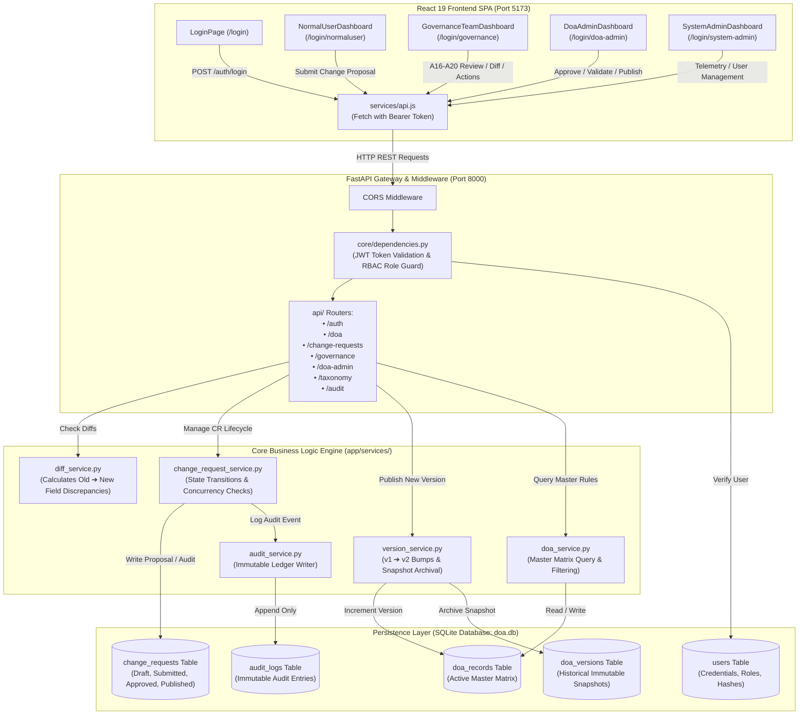

# Delegation of Authority (DOA) Governance Workflow Tool — Technical & Architectural Guide

This document provides a comprehensive technical overview of the **Delegation of Authority (DOA) Governance Workflow Prototype**, covering codebase hierarchy, data flow architecture, database schemas, API topology, and the end-to-end governance lifecycle.

---

## 1. Codebase Hierarchy Structure

```text
DOA/
├── frontend/                       # React 19 Frontend SPA (Vite + TailwindCSS)
│   ├── package.json                # Frontend dependencies (React 19, Lucide, TailwindCSS, Vite)
│   ├── vite.config.js              # Vite bundler & dev server configuration
│   ├── tailwind.config.js          # Tailwind tokens (Protiviti navy/teal/slate theme)
│   ├── postcss.config.js           # PostCSS configuration
│   ├── index.html                  # Single-page application entry HTML
│   ├── public/                     # Static assets and favicon
│   ├── dist/                       # Production bundle (HTML, JS, CSS)
│   │
│   └── src/                        # Frontend Application Source
│       ├── main.jsx                # Root DOM mounting point
│       ├── index.css               # Global Tailwind utilities and base directives
│       ├── App.css                 # Custom component animations and layout styles
│       ├── App.jsx                 # Core orchestrator, RBAC routing, auth state & toast manager
│       │
│       ├── components/             # React View & Dashboard Components
│       │   ├── LoginPage.jsx       # Manual login with credential helpers & role redirector
│       │   └── dashboards/         # Dedicated Role-Based Landing Dashboards
│       │       ├── NormalUserDashboard.jsx       # Requester console: search, view rules, draft proposals
│       │       ├── GovernanceTeamDashboard.jsx   # Second-line reviewer cockpit: A16-A20
│       │       ├── DoaAdminDashboard.jsx         # Executive delegation administrator cockpit
│       │       └── SystemAdminDashboard.jsx      # Telemetry, user management, ETL trigger
│       │
│       ├── services/
│       │   └── api.js              # Centralized asynchronous HTTP client (Fetch, JWT bearer auth)
│       │
│       └── data/
│           └── initialDoaData.js   # Fallback mock taxonomy & bootstrap authority definitions
│
└── backend/                        # Backend REST API Service (Python FastAPI & SQLite)
    ├── requirements.txt            # Python dependencies (FastAPI, Uvicorn, SQLAlchemy, Pydantic, Jose, BCrypt)
    ├── doa.db                      # Primary SQLite relational database
    ├── test_doa.db                 # Automated test isolated SQLite instance
    │
    └── app/                        # Application Package
        ├── main.py                 # FastAPI app entry point, CORS middleware, router registration
        │
        ├── core/                   # Core Security & Configuration
        │   ├── config.py           # Application settings, JWT secret, CORS origins, DB path
        │   ├── security.py         # Passlib password hashing (BCrypt) & python-jose JWT token generation
        │   └── dependencies.py     # FastAPI dependency injection (get_current_user, require_roles RBAC)
        │
        ├── database/               # Relational Persistence Layer
        │   ├── database.py         # SQLAlchemy engine, SessionLocal factory, get_db dependency
        │   └── models.py           # Relational ORM models: User, DOARecord, DOAVersion, ChangeRequest, AuditLog
        │
        ├── schemas/                # Pydantic Schemas & DTOs
        │   └── schemas.py          # Data validation schemas: User, Token, DOA, ChangeRequest, Diff, GovernanceAction
        │
        ├── services/               # Core Business Logic & Domain Services
        │   ├── doa_service.py              # DOA record CRUD, filter queries, archiving, and retirement
        │   ├── change_request_service.py   # Change request lifecycle: create, approve, reject, publish, audit logging
        │   ├── diff_service.py             # Field-level delta engine: compares current vs proposed (ADDED, MODIFIED, REMOVED)
        │   ├── version_service.py          # Master versioning engine, historical JSON snapshots, rollback inspection
        │   └── audit_service.py            # Immutable compliance audit trail recorder
        │
        ├── api/                    # Modular API Routers (Prefix: /api)
        │   ├── auth.py             # Authentication: POST /api/auth/login, GET /api/auth/me
        │   ├── doa.py              # DOA Records: GET /api/doa, GET /api/doa/{id}, POST /api/doa, DELETE /api/doa/{id}
        │   ├── change_requests.py  # Standard change request workflow & diff inspection
        │   ├── audit.py            # Audit trail querying: GET /api/audit (filterable by record_id, action)
        │   ├── dashboard.py        # Global metrics summary: GET /api/dashboard/summary
        │   ├── taxonomy.py         # Relational master data: functions, committees, governance docs, rules
        │   ├── normal_user.py      # Role-dedicated endpoints for Department Requesters
        │   ├── governance_team.py  # Role-dedicated endpoints for Governance Reviewers (A16-A20 actions)
        │   ├── doa_admin.py        # Role-dedicated endpoints for DOA Administrators (validation, release)
        │   └── system_admin.py     # System telemetry, user management, and health checks
        │
        ├── seed.py                 # Database bootstrap script (creates 4 test users + 53 baseline records)
        └── seed_doa_data.json      # Structured baseline dataset extracted from enterprise DOA matrix
```

---

## 2. Data Flow Architecture

The following diagram demonstrates the end-to-end data flow between React frontend components, FastAPI routing controllers, domain business logic services, and the SQLite relational storage layer.



---

## 3. Theoretical Summary of the End-to-End Workflow

The platform provides a complete **Two-Lines-of-Defense (2LoD)** governance model for corporate authority matrices, ensuring that no single individual can modify, overwrite, or retire an approved decision rule without rigorous technical diff inspection, dual review, and audit logging.

### 3.1 Authentication & Role-Based Access Control (RBAC)
1. **Single Entry Point (`/login`)**: Users access the common authentication page.
2. **Backend Authentication (`POST /api/auth/login`)**:
   - Passwords are verified against salted BCrypt hashes stored in `users`.
   - The backend signs a JWT access token encoding user `sub` (email) and `role`.
3. **Route Redirection**: The React client decodes the backend user profile and redirects the user to their designated workspace:
   - `NORMAL_USER` $\rightarrow$ `/login/normaluser`
   - `GOVERNANCE_TEAM` $\rightarrow$ `/login/governance`
   - `DOA_ADMINISTRATOR` $\rightarrow$ `/login/doa-admin`
   - `SYSTEM_ADMINISTRATOR` $\rightarrow$ `/login/system-admin`
4. **Backend Route Protection**: Endpoints enforce HTTPBearer token validation via `require_roles()`. Unauthorized cross-role requests result in HTTP 403 Forbidden.

---

### 3.2 Change Proposal Formulation (`NORMAL_USER` or `DOA_ADMINISTRATOR`)
1. **Proposal Initiation**:
   - Requesters can propose an **ADD** (new authority rule), **MODIFY** (alter existing limits/tiers), or **DELETE** (retire obsolete rule).
2. **Pre-Submission Validation**:
   - The client invokes `POST /api/doa-admin/validate-record`.
   - The validation engine checks for:
     - Duplicate entries in the same department and process area.
     - Mandatory field completeness (Decision Area, Function, Authority chain).
     - Statutory compliance rules (mandatory dual approvals if regulatory mandate is flagged `Y`).
3. **Draft & Submission**:
   - When finalized, the request is stored in `change_requests` with status `SUBMITTED`.
   - A snapshot of the active record is captured in `current_value`, while proposed changes are stored in `proposed_value`.
   - The `base_version` is locked (e.g. `1`) to facilitate optimistic concurrency checks.
   - An immutable audit log entry is recorded: `SUBMIT_CHANGE`.

---

### 3.3 Governance Review & Discrepancy Inspection (`GOVERNANCE_TEAM` — A16 to A19)
1. **Change Queue (A16)**:
   - The Governance Team accesses the central review queue, with multi-dimensional filtering across:
     - Status (`Open`, `Overdue`, `Approved`, `Rejected`, `Returned/Clarification`, `Published`).
     - Department & Process (`Finance`, `Risk`, `Treasury`, etc.).
     - Impact Level (High / Statutory Regulatory vs. Standard Internal).
2. **Current vs. Proposed Diff Inspector (A17 & A18)**:
   - Selecting a request triggers `GET /api/governance/queue/{cr_id}/diff`.
   - The server compares `current_value` vs `proposed_value` field by field.
   - The UI renders side-by-side comparisons:
     $$\text{Old Value (Current)} \longrightarrow \text{New Value (Proposed)}$$
   - Discrepancies are highlighted for Decision Areas, Financial Thresholds, Authority Operators (`A`, `E`, `R`, `P`, `N`), Governance Bodies, and Regulatory References.
3. **Governance Actions (A19)**:
   - **Request Clarification**: Moves request to `CLARIFICATION_REQUIRED`, requiring additional evidence or Board minutes.
   - **Add Comment**: Attaches formal risk review remarks.
   - **Tag Stakeholders**: Tags key oversight bodies (e.g. Board Audit Committee, Head of Compliance).
   - **Re-Route**: Directs the request to specialized governance committees (e.g., Executive Committee, Risk Committee).
   - **Escalate**: Flags critical regulatory exposures or threshold conflicts directly to executive administrators.

---

### 3.4 Approval & Controlled Publication (`GOVERNANCE_TEAM` & `DOA_ADMINISTRATOR` — A20)
1. **Approval**:
   - The authorized reviewer issues formal approval (`POST /api/change_requests/{cr_id}/approve`).
   - The request status advances to `APPROVED`.
   - **Critical Rule**: Approved requests **do not immediately overwrite the live DOA matrix**.
2. **Pre-Publication Integrity Verification**:
   - When the user triggers "Controlled Publication", the backend verifies:
     - The request is strictly in `APPROVED` status.
     - **Optimistic Concurrency Check**: If the target DOA record was modified by another concurrent request while this request was pending review (i.e. `live_version != cr.base_version`), the system aborts publication with an **HTTP 409 Conflict** error to prevent race conditions.
3. **Atomic Master Version Increment**:
   - The master record in `doa_records` is updated with the new values.
   - The version counter is incremented ($v_n \rightarrow v_{n+1}$, e.g. $v1 \rightarrow v2$).
   - A complete JSON snapshot of the predecessor version is created in `doa_versions` with status `HISTORICAL`.
   - The change request status transitions to `PUBLISHED`.
   - An immutable audit trail entry is logged: `PUBLISH_CHANGE`.

---

### 3.5 Compliance Audit Trail & Historical Snapshot Inspection
1. **Immutable Audit Ledger**:
   - Every mutation (creation, approval, rejection, clarification, re-route, escalation, publication, archiving) is recorded in `audit_logs` with a UTC timestamp, user ID, email, action type, and JSON payload diff.
   - Audit records are append-only; update and delete operations are prohibited.
2. **Version History Inspector**:
   - Governance reviewers can select any master DOA record and view historical snapshots across all published versions ($v1, v2, \dots$), inspecting the exact state of corporate authority at any point in time.

---

## 4. Key Relational Database Entities

| Table Name | Purpose | Primary Key | Key Foreign Keys / Indexed Attributes |
| :--- | :--- | :--- | :--- |
| **`users`** | Authentication credentials, full names, active statuses, and RBAC roles (`NORMAL_USER`, `GOVERNANCE_TEAM`, `DOA_ADMINISTRATOR`, `SYSTEM_ADMINISTRATOR`). | `id` (Integer) | `email` (Unique, Index) |
| **`doa_records`** | The active, legally binding Delegation of Authority master matrix. Preserves all 7 authority tiers, regulatory flags, and current version numbers. | `id` (String) | `status`, `parent_function`, `business_line` |
| **`change_requests`** | Formal change governance proposals. Stores `current_value` snapshot, `proposed_value` changes, `base_version`, status, requester, and reviewer notes. | `id` (String, e.g. `CR-0001`) | `doa_id` $\rightarrow$ `doa_records.id`, `requester_id` $\rightarrow$ `users.id` |
| **`doa_versions`** | Historical version repository. Stores frozen full JSON snapshots of past published records for rollback inspection and compliance auditing. | `id` (Integer) | `doa_id` $\rightarrow$ `doa_records.id`, `version_number` |
| **`audit_logs`** | Append-only compliance log recording every action, user email, entity, timestamp, and field diff. | `id` (Integer) | `record_id`, `action`, `timestamp` |

---

## 5. Summary of Roles & Permissions

| Role | Default Route | Key Responsibilities | Permitted Actions |
| :--- | :--- | :--- | :--- |
| **`NORMAL_USER`** | `/login/normaluser` | Departmental Requester | Search matrix, view published rules, draft new change requests (ADD / MODIFY / DELETE), review personal proposal status. |
| **`GOVERNANCE_TEAM`** | `/login/governance` | Second-Line Reviewer (Risk & Compliance) | Access review queue (A16), inspect Current vs. Proposed diffs (A17/A18), add comments, request clarification, tag stakeholders, re-route, escalate (A19), controlled publication (A20). |
| **`DOA_ADMINISTRATOR`** | `/login/doa-admin` | Chief Delegation Officer / Executive Administrator | Full matrix CRUD, schema validation, approve/reject change requests, publish master versions ($v1 \rightarrow v2$), archive/retire rules, run workflow simulations. |
| **`SYSTEM_ADMINISTRATOR`** | `/login/system-admin` | Platform Engineer / Database Administrator | User management, password resets, backend telemetry monitoring, ETL triggers, database maintenance, full audit trail access. |
